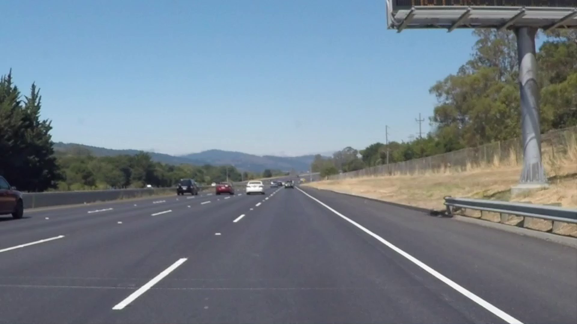
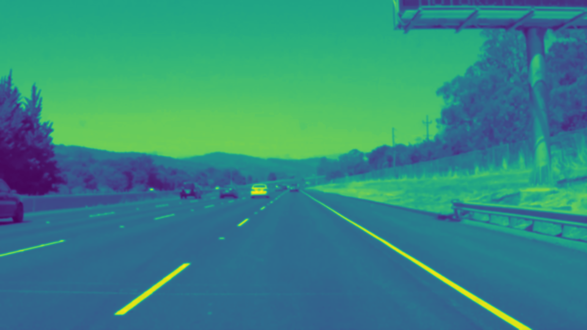
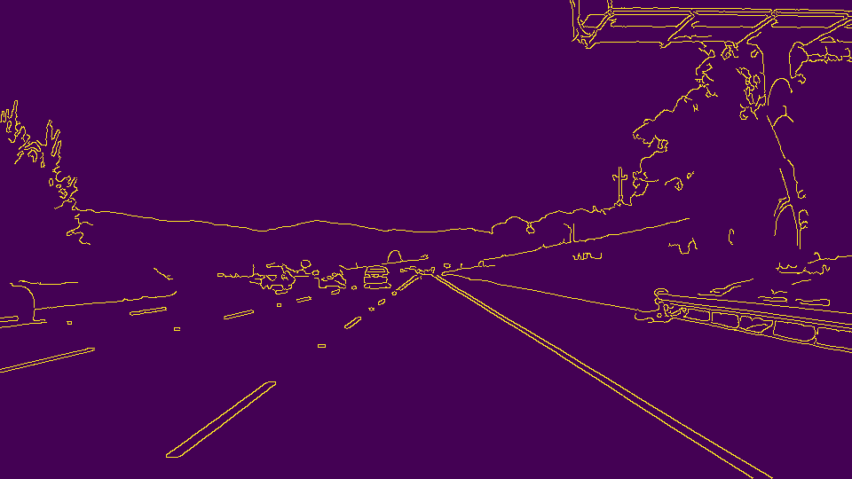
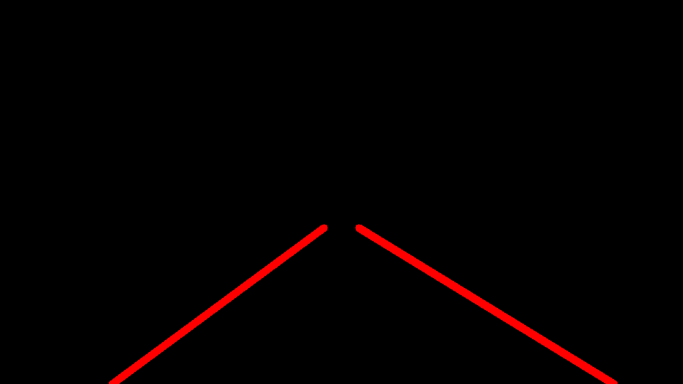
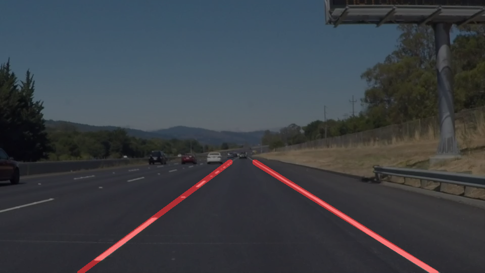

# **Finding Lane Lines on the Road** 

## Writeup Template

### You can use this file as a template for your writeup if you want to submit it as a markdown file. But feel free to use some other method and submit a pdf if you prefer.

---

**Finding Lane Lines on the Road**

The goals / steps of this project are the following:
* Make a pipeline that finds lane lines on the road
* Reflect on your work in a written report

[//]: # (Image References)

[image1]: (./examples/grayscale.jpg) "Grayscale"

--

### Reflection

### 1. Describe your pipeline. As part of the description, explain how you modified the draw_lines() function.

My pipeline consisted of seven (7) steps: 

  1. I converted the images to grayscale in order to more easily find road edges in the following steps.
  2. I blurred the grayscale images using the CV2 gaussian blur function (kernel_size=11) to smooth out the rough edges in the grayscale images. 
  3. I used the cv2.Canny() function to find the Canny edges for pixel gradients with low_threshold=75 and high_threshold=150 in the blurred images.  
  4. I worked out a region of interest in the video stream to narrow in on the left and right lanes on the road.  From the region of interest in the video frames I created masked images that showed the Canny edges for just in the region of interest where the lane lines would be.
  5. I calculated the Probabilistic Hough Transforms on the Canny edges to detect lines using parameters: 
rho=1, theta=np.pi/180, threshold=30 , min_line_len=15, max_line_gap=5.  The Hough parameters were found by trial and error to help balance having too many lines that were't credible and not having enough lines to create a line extrapolation in the next step.  The parameters helped filter out objects that were not related to lane lines like: trash in the road, others cars, road reflectors, and stray markings on the roads.  Also, they helped to filter out lane markings which were not suitable for further processing.  
  6. Using the Hough lines I split them into left and right lines corresponding to left lane and right lane lines using their  slopes.  From the Hough line (x,y) points I drew left and right road lanes onto the masked images.  

     My draw_lines() function consisted of three methods: 

    (1) default: using the cv2.line() function with the raw (x,y) points from the Hough Lines.
    (2) using linear regression to find the slopes and intercepts from the raw (x,y) points.
    (3) using a weighted average of slope and intercepts from the raw (x,y) points.

     I wanted to extrapolate the line data to draw solid lane lines on the roads so I used (2) and (3) to do that.  I found that (3) the weighted average approach gave the most stable lines in consecutive frames probably because it gave more weight to longer (and more credible) lines rather than giving equal weight to each point in (2) the linear regression approach.

  7. Finally, I overlayed the lane lines onto the original frame images using the cv2.addWeighted() function.

Here is an example of the pipeline in images:

 "Original Image"
 "Grayscale Image (Luminance)"
 "Blurred Image (Luminance)"
 "Canny Edges (Luminance)"
 "Masked Image (Luminance)"
 "Lane Lines Image"
 "Overlay Image"

Here are the full videos with the pipeline applied.

White Markings:

 "Solid White Right"

Yellow Markings:

 "Solid Yellow Left"

### 2. Identify potential shortcomings with your current pipeline

One potential shortcoming would be what would happen when the car (and camera) does not stay in the middle of the lane.  My region of interest may not be able to pick up both lane lines or enough points to create an accurate extrpolation.

Another shortcoming could be if the lanes were curved and my linear extrapolations would not match the true lane lines.

Yet another shortcoming is if the video frames had another shape besides what I used in this project.  My region of interest calculations and extrapolations would be way off.

### 3. Suggest possible improvements to your pipeline

A possible improvement would be to fit a polynomial curve or optimize the parameters for a curve fit if the lane lines are not straight.

Another potential improvement could be to automatically readjust the region of interest and extrpolation calculations for different sized video frames.
